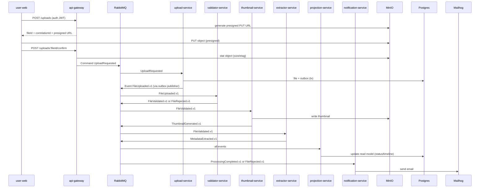

# Documento Inicial — Event-Driven Upload Pipeline (v0.1)

## 0) Setup local inicial (M0)

Este repositório foi preparado como **monorepo** com `pnpm`, com estrutura base para evoluir os apps e serviços.

### Estrutura base

```text
apps/
services/
packages/
infra/
```

### Pré-requisitos

- Node.js `22` (ver `.nvmrc`)
- `pnpm` `>= 10`
- Docker + Docker Compose (para a infraestrutura local)

### Preparar `pnpm` (recomendado com Corepack)

Com Node.js 22, o jeito recomendado é usar o `Corepack` para ativar a versão do `pnpm` definida no projeto:

```bash
corepack enable
corepack prepare pnpm@10.4.0 --activate
pnpm -v
```

Alternativa (global):

```bash
npm i -g pnpm
pnpm -v
```

> Evite misturar `npm` e `pnpm` neste repositório (ex.: gerar `package-lock.json` e depois usar `pnpm`).

### Instalação do projeto

```bash
pnpm install
cp .env.example .env
```

### Configuração por serviço (modo host / local)

Os backends NestJS agora usam `.env` próprio por serviço (com `@nestjs/config` + validação fail-fast).

Exemplos:

```bash
cp services/api-gateway/.env.example services/api-gateway/.env
cp services/upload-service/.env.example services/upload-service/.env
cp services/validator-service/.env.example services/validator-service/.env
```

Você pode repetir o mesmo padrão para os demais serviços em `services/*/.env.example`.

### Fluxo rápido para testar localmente (infra)

```bash
corepack enable
corepack prepare pnpm@10.4.0 --activate
pnpm install
cp .env.example .env
pnpm docker:up:infra
```

Para parar os containers:

```bash
pnpm docker:down:infra
```

### Fluxo rápido para subir stack completa (Docker dev: infra + backends)

```bash
corepack enable
corepack prepare pnpm@10.4.0 --activate
pnpm install
cp .env.example .env
pnpm docker:up
```

Logs da stack completa:

```bash
pnpm docker:logs
```

### Scripts raiz

```bash
pnpm dev
pnpm lint
pnpm format
pnpm test
pnpm test:unit
pnpm test:contracts
pnpm docker:up
pnpm docker:up:infra
pnpm docker:down
pnpm docker:down:infra
pnpm docker:logs
pnpm smoke
pnpm smoke:rejected
pnpm test:e2e
```

> `docker:up` sobe a stack dev completa (`infra/docker-compose.yml` + `infra/docker-compose.dev.yml`).
> Use `docker:up:infra` se quiser subir somente a infraestrutura.
> `smoke` executa um teste E2E automatizado (gateway -> MinIO -> pipeline -> projection/audit/notification/mailhog).
> `smoke:rejected` executa o fluxo E2E de falha (arquivo rejeitado pelo validator, com audit + notification).
> `test:e2e` encadeia os dois smokes.

### Infra local (Docker Compose)

Arquivos do ambiente local:

- `infra/docker-compose.yml`
- `infra/minio/init-minio.sh` (cria buckets e aplica policies)
- `infra/keycloak/import/realm-event-pipeline.json` (realm + clients + roles)

Subir infraestrutura:

```bash
corepack enable
corepack prepare pnpm@10.4.0 --activate
pnpm install
cp .env.example .env
pnpm docker:up:infra
```

Derrubar infraestrutura:

```bash
pnpm docker:down:infra
```

### Portas e URLs locais

- Postgres: `localhost:5432`
- RabbitMQ (AMQP): `localhost:5672`
- RabbitMQ Management: `http://localhost:15672`
- MinIO API (S3): `http://localhost:9000`
- MinIO Console: `http://localhost:9001`
- Keycloak: `http://localhost:8080`
- Mailhog (SMTP): `localhost:1025`
- Mailhog UI: `http://localhost:8025`

### Bootstrap local (MinIO + Keycloak)

- MinIO:
  - buckets: `uploads` (privado) e `thumbnails` (download anonimo para demo local)
- Keycloak:
  - realm: `event-pipeline`
  - roles: `user`, `admin`
  - clients: `user-web`, `admin-web`, `api-gateway`
  - usuarios demo:
    - `demo-user` / `demo123` (role `user`)
    - `demo-admin` / `demo123` (roles `user`, `admin`)

## 1) Visão geral

Construiremos uma plataforma **100% local e gratuita**, composta por:

- **2 frontends**: `user-web` e `admin-web` (apps separados)
- **microserviços NestJS** com responsabilidade única
- comunicação predominante **assíncrona via RabbitMQ**
- persistência em **PostgreSQL**
- armazenamento de arquivos em **MinIO (S3 local)**
- autenticação via **Keycloak**
- simulação de e-mails via **Mailhog**
- projeções de leitura (read model) para UI (**CQRS leve**)

A proposta central: um **pipeline de upload** em etapas (validar → gerar thumbnail → extrair metadata → finalizar) com rastreabilidade e atualização de status.

---

## 2) Objetivos do MVP

1. Permitir upload de arquivos (imagem inicialmente) e registrar o processamento por etapas.
2. Processar de forma assíncrona e escalável (mesmo local).
3. Exibir status em tempo real (ou “quase real”) para usuário e admin.
4. Garantir robustez mínima: **Outbox**, **Idempotência**, **Retry + DLQ**, **correlationId**.

---

## 3) Stack (local / gratuita)

**Infra (Docker Compose)**

- RabbitMQ (com management UI)
- Postgres (1 instância)
- MinIO (S3 local + console)
- Keycloak
- Mailhog

**Backend**

- NestJS (microservices + `@nestjs/microservices`)
- ORM: Prisma ou TypeORM (escolhemos depois, mas o design já prevê outbox)
- Processamento:
  - imagens: `sharp` (thumbnail + metadata)

**Frontend**

- **React + Vite** (recomendado para admin e user)

> Next.js também funciona, mas Vite vai te dar menos atrito no começo e é perfeito para apps internos.

---

## 4) Serviços e responsabilidades

### 4.1 Frontends

- **user-web**
  - login (Keycloak)
  - upload + acompanhamento do status do processamento
  - lista “meus uploads”

- **admin-web**
  - visão global de uploads/processamentos
  - reprocessar/forçar retry (via comando)
  - visualizar erros e DLQ (opcional via endpoints)

### 4.2 Backend (microserviços)

1. **api-gateway** (HTTP/BFF)

- Expõe REST para os frontends
- Valida JWT do Keycloak (RBAC: user/admin)
- Inicia upload com **presigned URL** MinIO (`POST /uploads`)
- Confirma upload e publica **Commands** no RabbitMQ (`POST /uploads/:fileId/confirm`)
- Fornece endpoints de leitura consultando **read model** (projection)
- Endpoints admin de operação para **DLQ** (listar, inspecionar e re-drive)

2. **upload-service** (Command handler)

- Recebe comando `UploadRequested` (após confirmação do upload no gateway)
- Persiste `file` + `outbox_events`
- Publica `FileUploaded.v1`

3. **validator-service** (Event consumer)

- Consome `FileUploaded.v1`
- Valida (mime, tamanho, assinatura, integridade)
- Publica `FileValidated.v1` ou `FileRejected.v1`
- Implementa idempotência via `processed_events`

4. **thumbnail-service** (Event consumer)

- Consome `FileValidated.v1`
- Gera thumbnail e salva no MinIO (`thumbnails/`)
- Publica `ThumbnailGenerated.v1`

5. **extractor-service** (Event consumer)

- Consome `FileValidated.v1`
- Extrai metadata (ex: width/height, checksum, etc.)
- Publica `MetadataExtracted.v1`

6. **projection-service** (Read model / CQRS)

- Consome _todos_ eventos relevantes
- Mantém tabelas otimizadas para leitura:
  - status por etapa
  - histórico/timeline
  - listagens para admin/user

- É o “banco” que a UI consulta

7. **notification-service** (opcional mas incluído)

- Consome eventos (ex: `ProcessingCompleted.v1`, `FileRejected.v1`)
- Envia e-mail via SMTP no **Mailhog**
- (opcional) publica `NotificationSent.v1`

8. **audit-service** (opcional mas incluído)

- Consome todos eventos (ou subset)
- Persiste **audit log imutável**
- Ajuda em rastreabilidade e debugging

---

## 5) Comunicação entre componentes

### 5.1 Padrão geral

- **HTTP (sync):** frontends → api-gateway (apenas)
- **RabbitMQ (async):** gateway → serviços (commands), serviços → serviços (events)
- **Postgres:** cada serviço é dono do seu modelo (preferência: DB/schema por serviço)
- **MinIO:** armazenamento binário (upload + thumbnail)

### 5.2 Commands vs Events

- **Commands**: ponto-a-ponto, direcionados a 1 serviço (“faça X”)
  - Ex: `UploadRequested`, `ReprocessFileRequested`

- **Events**: publish/subscribe, múltiplos serviços podem reagir (“X aconteceu”)
  - Ex: `FileUploaded.v1`, `FileValidated.v1`, etc.

> No RabbitMQ, normalmente:

- Commands → **fila direta** (`q.upload.commands`, `q.admin.commands`, etc.)
- Events → **exchange topic** `domain.events` com routing keys

---

## 6) Topologia do RabbitMQ (proposta)

### Exchanges

- `domain.events` (tipo: topic) → eventos
- `domain.commands` (tipo: direct/topic) → comandos

### Routing keys (exemplos)

- `files.uploaded.v1`
- `files.validated.v1`
- `files.rejected.v1`
- `thumbs.generated.v1`
- `metadata.extracted.v1`
- `processing.completed.v1`
- `commands.upload.requested.v1`
- `commands.file.reprocess.v1`

### Queues (exemplos)

- `q.upload.commands` (bind `commands.upload.*`)
- `q.validator` (bind `files.uploaded.*`)
- `q.thumbnail` (bind `files.validated.*`)
- `q.extractor` (bind `files.validated.*`)
- `q.projection` (bind `#`)
- `q.notification` (bind `processing.*`, `files.rejected.*`)
- `q.audit` (bind `#`)

### DLQ / Retry

Para cada queue:

- `q.X` com `x-dead-letter-exchange` → `dlx.X`
- retries via TTL + dead-letter (ou lib de retry)
- `q.X.dlq` para falhas finais

---

## 7) Contrato de mensagens (Envelope)

Adotaremos um envelope único para todo mundo:

```ts
type MessageEnvelope<T> = {
  eventId: string; // uuid
  type: string; // e.g. "FileUploaded.v1"
  occurredAt: string; // ISO date
  correlationId: string; // rastrear o fluxo inteiro
  causationId?: string; // evento que causou esse
  producer: string; // service name
  payload: T; // dados do evento/command
  version: number; // versão do schema (além do sufixo .v1)
};
```

**Regras**

- `payload` deve ser **mínimo necessário** (evitar acoplamento)
- Identificadores consistentes: `fileId`, `bucket`, `objectKey`, `tenantId?`, `userId?`

---

## 8) Fluxo principal (pipeline)

### 8.1 Sequência (alto nível)



### 8.2 Como a UI “vê” o status

- user/admin chama `GET /uploads/:fileId/status`
- gateway lê do **projection-service DB** (read model)
- opcional: `notification-service` expõe SSE/WebSocket para push

---

## 9) Requisitos funcionais (RF)

**RF-01** Autenticação e autorização

- Login via Keycloak
- Perfis: `user` e `admin`

**RF-02** Upload de arquivo

- Usuário consegue iniciar upload e receber `fileId` + `correlationId`

**RF-03** Pipeline por etapas

- Ao receber upload, o sistema executa:
  1. validação
  2. thumbnail
  3. extração de metadata
  4. finalização (completado/erro)

**RF-04** Status do processamento

- Usuário e admin conseguem ver status por etapa (pending/processing/done/failed)

**RF-05** Histórico/timeline

- Cada evento relevante aparece na timeline do upload

**RF-06** Admin: reprocessar

- Admin pode disparar `ReprocessFileRequested` (com nova correlationId)

**RF-07** Notificações por e-mail (simulado)

- Ao completar ou falhar, enviar e-mail para Mailhog (para inspeção)

**RF-08** Auditoria

- Persistir auditoria de eventos (mínimo: tipo, occurredAt, correlationId, payload resumido)

---

## 10) Requisitos não funcionais (RNF)

**RNF-01** Confiabilidade de publicação (Outbox)

- Eventos só são publicados após commit da transação
- `upload-service`, `projection-service`, `validator-service`, `thumbnail-service` e `extractor-service` usam outbox com publisher desacoplado
- Retry operacional de outbox (MVP): tentativas limitadas por config (`*_OUTBOX_MAX_PUBLISH_ATTEMPTS`) e falha terminal com `publish_status = 'failed'`

**RNF-02** Idempotência em consumers

- Cada consumer deve ignorar duplicatas (por `eventId` + store local)

**RNF-03** Retry e DLQ

- Falhas temporárias → retry automático
- Falhas permanentes → DLQ com visibilidade no admin
- Re-drive administrativo via endpoints protegidos por role `admin` no `api-gateway`
- Politica MVP implementada nos consumers: ate `3` tentativas (via `x-death`) e parking manual em `q.*.dlq`
- Re-drive em modo seguro: leitura da DLQ via AMQP com `ack` somente apos `publish confirm` no exchange de retry
- Trilha operacional de re-drive: evento `DlqRedriveCompleted.v1` com `operationCorrelationId` (auditável no `audit-service`)

**RNF-03.1** Timeouts e limites (MVP)

- `api-gateway` valida limite de upload e MIME permitido por configuracao (`API_GATEWAY_UPLOAD_MAX_SIZE_BYTES`, `API_GATEWAY_ALLOWED_MIME_TYPES`)
- Timeouts configuraveis para chamadas externas no gateway:
  - `JWT_JWKS_FETCH_TIMEOUT_MS`
  - `API_GATEWAY_RABBITMQ_MANAGEMENT_TIMEOUT_MS`
- Workers mantem limites/tipos suportados por config (validator/thumbnail/extractor)

**RNF-04** Observabilidade básica

- Logs estruturados com `correlationId`
- Métricas (opcional v0.2)
- Cobertura atual: bootstraps, consumers/publishers AMQP, use cases principais, outbox pollers, repositorios/infra e operacao do `api-gateway` (DLQ admin, command publisher, filtro HTTP)

**RNF-04.1** Erros HTTP padronizados (gateway)

- `api-gateway` aplica filtro global de excecao com envelope padronizado:
  - `error.code`
  - `error.message`
  - `statusCode`
  - `correlationId`
  - `path`
  - `method`
- O gateway tambem registra erros HTTP em log JSON (warn/erro conforme status)

**RNF-05** Segurança local

- JWT verificado no gateway
- serviços internos não expostos fora do compose network

**RNF-06** Evolução de contrato

- Eventos versionados (`.v1`, `.v2`)
- Compatibilidade backward sempre que possível

---

## 11) Conectando tudo (visão de arquitetura)

```mermaid
flowchart LR
  subgraph Front
    UW[user-web (Vite)]
    AW[admin-web (Vite)]
  end

  subgraph Edge
    GW[api-gateway (Nest HTTP)]
  end

  subgraph Broker
    MQ[(RabbitMQ)]
  end

  subgraph Services
    UP[upload-service]
    VA[validator-service]
    TH[thumbnail-service]
    EX[extractor-service]
    PR[projection-service]
    NO[notification-service]
    AU[audit-service]
  end

  subgraph Infra
    PG[(Postgres)]
    S3[(MinIO)]
    KC[(Keycloak)]
    MH[(Mailhog)]
  end

  UW -->|HTTP + JWT| GW
  AW -->|HTTP + JWT| GW
  GW -->|validate token| KC

  GW -->|commands| MQ
  MQ --> UP
  MQ --> VA
  MQ --> TH
  MQ --> EX
  MQ --> PR
  MQ --> NO
  MQ --> AU

  UP --> PG
  PR --> PG
  AU --> PG
  UP --> S3
  TH --> S3
  NO --> MH
```

---

## 12) Estrutura de repositório (sugestão)

Monorepo facilita muito localmente:

- `apps/user-web` (Vite)
- `apps/admin-web` (Vite)
- `services/api-gateway`
- `services/upload-service`
- `services/validator-service`
- `services/thumbnail-service`
- `services/extractor-service`
- `services/projection-service`
- `services/notification-service`
- `services/audit-service`
- `infra/docker-compose.yml`
- `packages/shared` (tipos de mensagens, util de correlationId, libs comuns)

---

## 12.1) Estrutura interna dos serviços backend (DDD tático)

Os serviços NestJS backend foram padronizados com **DDD tático** para facilitar testabilidade e evolução.

Estrutura padrão por serviço:

```text
src/
  domain/          # entidades, value objects, regras puras, tipos de domínio
  application/     # use cases, ports (interfaces/tokens), orquestração
  infrastructure/  # adapters concretos (RabbitMQ, Postgres, MinIO, Keycloak, etc.)
  presentation/    # controllers HTTP, consumers AMQP, workers/schedulers, guards
  app.module.ts    # composition root / wiring de dependências
  main.ts          # bootstrap
```

Regras práticas de dependência:

- `presentation` depende de `application` (e pode usar tipos de `domain`)
- `application` depende de `domain` e de `ports` (interfaces), não de adapters concretos
- `infrastructure` implementa `ports` da `application`
- `domain` não depende de NestJS nem de infraestrutura

Exemplos atuais:

- `services/api-gateway` (auth, endpoints v0, presigned URL + confirmação)
- `services/upload-service` (command handler + outbox publisher)
- `services/validator-service` (consumer `FileUploaded.v1`, validação, idempotência)

---

## 13) Próximos passos (para fechar o planejamento)

1. Definir o **MVP do upload**:
   - decisão tomada no MVP atual: **presigned URL MinIO + confirmação no gateway**
   - evolução futura opcional: multipart/resumable upload

2. Definir estratégia de DB:
   - 1 Postgres com **1 database por serviço** (recomendado)
     **ou** 1 DB com **schemas por serviço**

3. Definir read model mínimo:
   - `uploads` + `upload_steps` + `upload_timeline`

4. Fechar lista oficial de eventos v1 e payloads mínimos

## 13.1) Fase pré-item 6 (configuração e Docker)

Antes de avançar no item `6` (catálogo de eventos/contratos), foi aberta uma fase de padronização para deixar o projeto mais consistente para portfólio e operação local:

1. Config por serviço (`upload-service` + `validator-service`) com `@nestjs/config` + validação
2. Replicar padrão para demais backends
3. Criar `.env.example` por serviço/backend
4. Limpar scripts `start/dev` (sem `source` manual)
5. Adicionar `Dockerfile` multi-stage por backend (`dev`/`build`/`prod`)
6. Criar compose full dev (`infra` + `backends`) para subir a stack completa com um comando
7. Atualizar README com fluxo local (host) e fluxo Docker full stack

Documento de acompanhamento:

- `docs/config-and-docker-plan.md`
- `docs/events.md` (catalogo v1 de commands/events + exemplos JSON)
- `docs/architecture.md` (runtime topology, flows, DDD boundaries, reliability, shadow process manager)

Status funcional atual (smoke-test completo validado):

- fluxo happy-path local confirmado: `POST /uploads` -> PUT MinIO (presigned) -> `confirm`
- timeline projetada ate `ProcessingCompleted.v1`
- `notification-service` envia e-mail para Mailhog no evento `ProcessingCompleted.v1`
- `projection-service` publica `ProcessingCompleted.v1` via outbox (MVP robustecido)
- `projection-service` tambem executa um **shadow process manager** que persiste estado em `processing_manager.processing_sagas` e compara o resultado calculado com a conclusao atual (`comparison_status=match` no smoke validado)

Status atual da fase:

- Template de config validada com `@nestjs/config` implementado em `upload-service` e `validator-service`
- Config/validação replicada para todos os backends (`api-gateway` + workers + upload-service)
- `.env.example` por backend criado e scripts `start/dev` limpos (sem `source` manual)
- Dockerfiles multi-stage (`dev`/`build`/`prod`) criados para todos os backends
- Compose full dev (`infra` + `backends`) criado em `infra/docker-compose.dev.yml`
- Scripts raiz atualizados: `docker:up` (stack completa), `docker:up:infra`, `docker:down`, `docker:logs`
- `docs/architecture.md` agora consolida topologia, fluxos, boundaries DDD e estrategia de confiabilidade
- Próxima etapa principal: fechar a suite da Saga (`happy path`, `failure`, `timeout`) e depois fazer o cutover controlado do terminal event para o process manager em v0.2

---

## 13.2) Evolução da Saga (v0.2 roadmap + shadow mode)

O projeto **já é Event-Driven Design** e atualmente coordena a conclusão do pipeline de forma implícita no `projection-service`.

O estado atual da adoção é:

- o `projection-service` continua sendo o produtor oficial de `ProcessingCompleted.v1`
- um **Process Manager em modo shadow** já observa os mesmos eventos, persiste estado próprio e compara seu resultado com a conclusão atual

Para a evolução v0.2 (sem quebrar o MVP atual), a direção arquitetural definida continua sendo:

- **Saga coreografada com Process Manager explícito**
- `projection-service` voltando ao foco principal de **read model**
- regras de `completed` / `failed` / `timed-out` modeladas de forma explícita e testável

Documentação da decisão e roadmap:

- `docs/saga.md`
- `docs/adr/0001-saga-adoption.md`

Observação:

- A adoção da Saga segue incremental: primeiro shadow mode, depois validação de consistência, depois cutover do terminal event. O fluxo event-driven atual permanece intacto no MVP.

---
