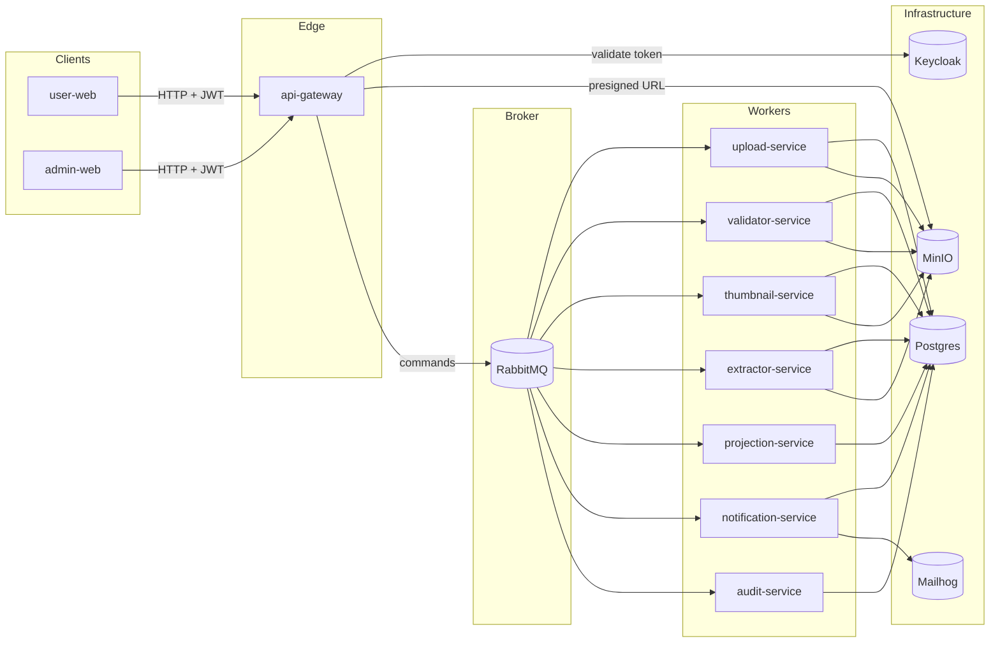
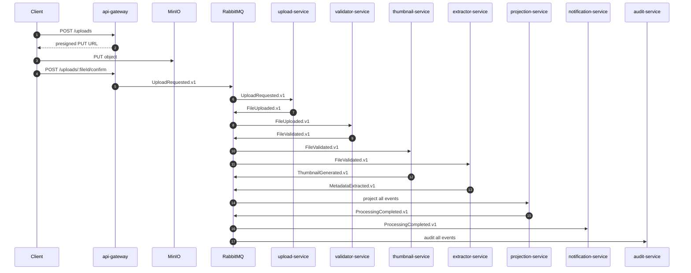
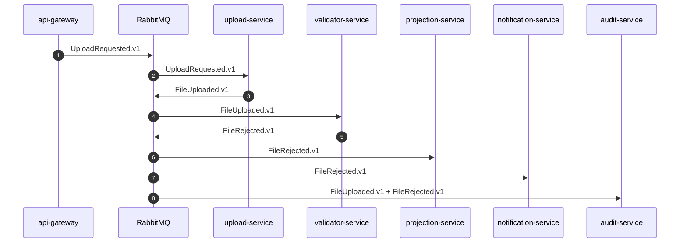

# Architecture Overview

## Purpose

This repository implements an event-driven upload pipeline for portfolio demonstration.

The current MVP focuses on:

- local-first operability with Docker
- explicit message contracts and delivery guarantees
- tactical DDD boundaries in every backend service
- observable asynchronous processing

## Monorepo Layout

- `services/`
  - NestJS backends (`api-gateway`, `upload-service`, `validator-service`, `thumbnail-service`, `extractor-service`, `projection-service`, `notification-service`, `audit-service`)
- `packages/shared`
  - message envelopes, message catalog, routing-key standards, JSON logging helpers
- `infra/`
  - Docker Compose, RabbitMQ topology, Postgres migrations, MinIO bootstrap, Keycloak import
- `docs/`
  - architecture, events catalog, RabbitMQ topology, ADRs, saga roadmap
- `tests/`
  - root-level `node:test` unit tests and contract tests

## Runtime Topology

## Service Responsibilities

### `api-gateway`

- validates JWTs from Keycloak
- issues MinIO presigned upload URLs
- confirms uploaded objects before publishing `UploadRequested.v1`
- exposes admin operations for reprocess and DLQ re-drive

### `upload-service`

- consumes upload commands
- persists `upload_service.files`
- stores domain events in the outbox
- publishes `FileUploaded.v1`

### `validator-service`

- consumes `FileUploaded.v1`
- validates declared MIME type, object size, and binary signature
- publishes `FileValidated.v1` or `FileRejected.v1`

### `thumbnail-service`

- consumes `FileValidated.v1`
- generates a thumbnail for supported image formats
- stores thumbnails in MinIO
- publishes `ThumbnailGenerated.v1`

### `extractor-service`

- consumes `FileValidated.v1`
- extracts metadata (for example dimensions and checksums)
- publishes `MetadataExtracted.v1`

### `projection-service`

- consumes all relevant domain events from `q.projection`
- maintains the read model used by future frontends
- runs the explicit process manager used by the Saga
- publishes `ProcessingCompleted.v1`, `ProcessingFailed.v1`, and `ProcessingTimedOut.v1` through its outbox
- keeps the terminal-event cutover rollbackable through config

### `notification-service`

- consumes `ProcessingCompleted.v1` and `FileRejected.v1`
- sends e-mails through Mailhog SMTP
- persists notification delivery logs

### `audit-service`

- consumes all relevant domain events
- writes an immutable audit trail for debugging and traceability

## Current Happy-Path Flow

## Failure Flow (Validation Rejection)

## Data Ownership

The local MVP uses a single Postgres instance with schema ownership per service.

- `upload_service`
  - `files`
  - `outbox_events`
- `projection_service`
  - `uploads_read`
  - `upload_steps_read`
  - `upload_timeline_read`
  - `outbox_events`
- `notification_service`
  - `notification_logs`
  - `processed_events`
- `audit_service`
  - `audit_events`
- `validator_service`, `thumbnail_service`, `extractor_service`
  - `processed_events`
- `processing_manager`
  - `processing_sagas`
  - `processed_events`

This keeps the portfolio environment simple while preserving explicit ownership boundaries.

## Messaging and Reliability

### Exchanges

- `domain.commands`
- `domain.events`

### Reliability mechanisms

- outbox on event-producing services
- consumer-side idempotency via `processed_events`
- retry policy based on RabbitMQ `x-death`
- explicit DLQ parking per queue
- admin re-drive with AMQP confirm before DLQ `ack`

## Tactical DDD Boundaries

Each backend service follows the same structure:

- `domain`
  - business rules, value decisions, pure mapping logic
- `application`
  - use cases and port definitions
- `infrastructure`
  - concrete adapters (Postgres, RabbitMQ, MinIO, Keycloak)
- `presentation`
  - HTTP controllers, AMQP consumers, background workers

This keeps infrastructure concerns out of domain logic and improves testability.

## Shadow Process Manager (Saga Preparation)

The project already documents a future Saga evolution in `docs/saga.md`.

The current implementation now includes an explicit **process manager** inside `projection-service`:

- it consumes the same projectable events already handled by the read model
- it stores saga state in `processing_manager.processing_sagas`
- it keeps its own idempotency table in `processing_manager.processed_events`
- it publishes terminal events through the existing projection outbox
- it compares the calculated terminal state with the observed terminal event stream for consistency tracking

Current cutover model:

- the read model still projects terminal events, but it no longer decides when to emit them
- terminal publication is now owned by the process manager
- the cutover can be reverted with `PROJECTION_PROCESS_MANAGER_PUBLISH_TERMINAL_EVENTS=false`

This keeps the runtime simple while making Saga ownership explicit.

## Testing Strategy

Current baseline:

- root-level unit tests with `node:test`
- contract test validating every JSON example in `docs/events/examples`
- Docker E2E happy path: `pnpm smoke`
- Docker E2E rejected path: `pnpm smoke:rejected`
- Docker E2E timeout path: `pnpm smoke:timeout`
- combined Docker E2E suite: `pnpm test:e2e`

## Known Next Steps

- implement a dedicated read/query surface for the process manager if operational visibility becomes necessary
- build `user-web` and `admin-web` on top of the existing read model
